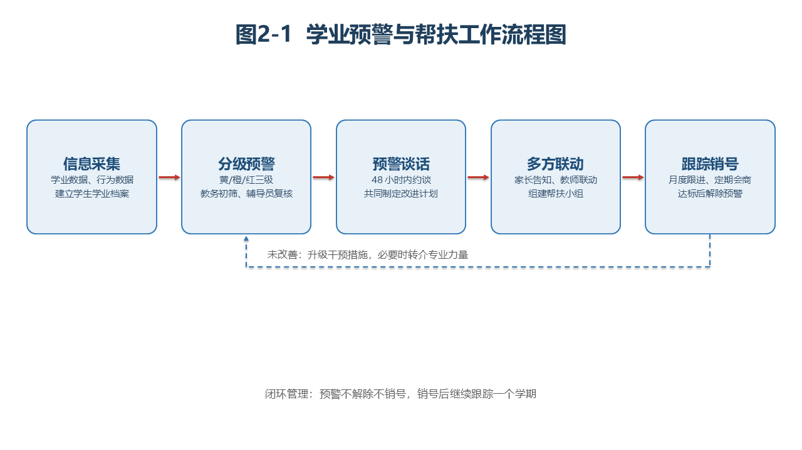
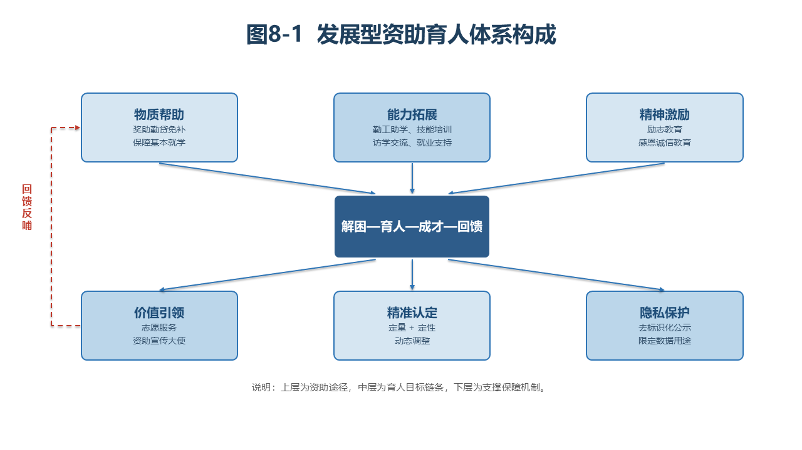
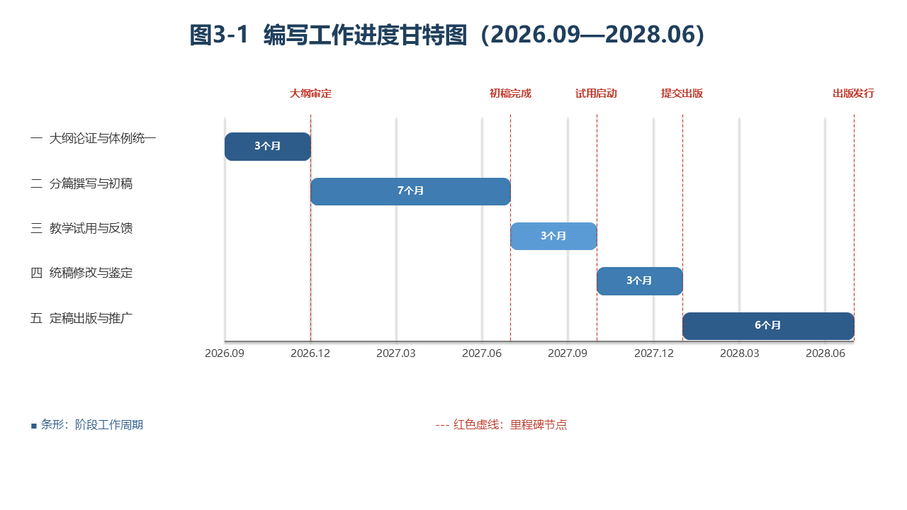

# pptx-editable-figures

> 生成**全可编辑**的 PPTX 插图 —— 流程图、体系图、甘特图、架构图。
> 用原生 PowerPoint 形状绘制，而非贴图：用户可在 PowerPoint / WPS 里直接改文字、拖位置、换配色。

AI 画的图常有个恼人的毛病：**箭头飘了**。看起来坐标算得挺对，渲染出来线却跑到画布别处去了。
这个仓库记录了该问题的根因、防御方案，以及一套不靠肉眼的自检体系。

---

## 为什么箭头会"飘"

不是坐标算错，是**坐标写成了浮点数**。

OOXML 的 EMU 坐标（`a:off` / `a:ext`）必须是整数。而 Python 的 `/` 产生 float，
python-pptx **不做取整就直接写进 XML**，于是生成了：

```xml
<a:off x="2414811.5" y="2697480.0"/>   ← 非法
```

控制变量实验（已实测，见 [docs/根因实验.md](docs/根因实验.md)）：

| 文件 | PowerPoint 打开 |
|---|---|
| 整数坐标 | ✅ 成功 |
| **浮点坐标** | ❌ **失败** |
| 同值取整回退 | ✅ 成功 |

PowerPoint 容错打开时**不报错**，只是让线条位置回退到默认值——表现就是箭头飘走。
所以这是个静默失败：你不主动验证，根本发现不了。

**本仓库的做法**：在底层把整数化做成强制，用本仓库的 API 就天然免疫。

---

## 快速开始

```bash
pip install -r requirements.txt
python examples/run_demo.py
```

产出 `examples/demo.pptx`（3 页：流程图 / 体系图 / 甘特图，全部原生形状可编辑），
并在终端打印自检结果与字符画预览。

---

## 效果预览

以下三张图**全部由 `examples/run_demo.py` 生成**，形状可在 PowerPoint 中直接编辑：

| 流程图（含闭环回流） | 体系图（三层汇聚 + 回馈） |
|---|---|
|  |  |

**甘特图**（自动时间刻度 + 里程碑虚线）：



---

## 三种用法

### 1. 用模板（推荐，改数据即可）

```python
import sys; sys.path.insert(0, "templates"); sys.path.insert(0, "scripts")
from figures import make_flowchart, make_system_diagram, make_gantt, merge_figures

f1 = make_flowchart(
    [("信息采集", "学业数据、行为数据\n建立学生学业档案"),
     ("分级预警", "黄/橙/红三级\n教务初筛、辅导员复核"),
     ("预警谈话", "48小时内约谈\n共定改进计划")],
    title="图2-1  学业预警与帮扶工作流程图",
    loop_from=2, loop_to=1,                    # 闭环回流：末框 → 第2框
    loop_label="未改善：升级干预措施",
    note="闭环管理：预警不解除不销号")

f2 = make_system_diagram(
    [("物质帮助", "奖助勤贷免补", "#D6E6F2"),
     ("能力拓展", "勤工助学、技能培训", "#BBD6EA"),
     ("精神激励", "励志教育", "#D6E6F2")],
    "解困—育人—成才—回馈",                      # 中心链条
    [("价值引领", "志愿服务", "#BBD6EA"),
     ("精准认定", "定量+定性", "#D6E6F2"),
     ("隐私保护", "去标识化公示", "#BBD6EA")],
    title="图8-1  发展型资助育人体系构成",
    loop_pair=(0, 0), loop_label="回馈反哺")   # 下层0号 → 上层0号

f3 = make_gantt(
    [("一  大纲论证", 0, 3, "#2E5C8A"),
     ("二  分篇撰写", 3, 7, "#3E7CB1")],
    {3: "初稿完成", 7: "提交出版"},
    title="图3-1  进度甘特图")

merge_figures([f1, f2, f3], "out.pptx")
```

### 2. 从零画（图型不在模板里）

```python
from pptxfig import Fig, verify

f = Fig(13.333, 7.5)                                  # 16:9
rec_a = f.box(1.0, 2.0, 2.15, 1.9, title="节点A", desc="说明",
              fill="#E8F1F8", line="#2E75B6")
rec_b = f.box(4.0, 2.0, 2.15, 1.9, title="节点B", desc="说明",
              fill="#E8F1F8", line="#2E75B6")
f.arrow_between(rec_a, rec_b, "h", color="#C0392B", width=2.5)  # 自动贴合边缘
f.save("out.pptx")

print(verify("out.pptx") or "几何自检通过")            # 返回问题列表，空即通过
```

### 3. 校验已有 PPTX

```bash
python scripts/check_render.py 你的文件.pptx
```

---

## 核心 API

| 方法 | 说明 |
|---|---|
| `.text` / `.box` / `.bar` | 文本框 / 圆角矩形 / 甘特条 |
| `.arrow(x1,y1,x2,y2,...)` | 直线箭头 |
| `.arrow_between(a,b,side)` | **框间箭头，自动贴合边缘**（side: `h` / `v` / `v-up`）|
| `.elbows(points,...)` | 折线箭头（回流、闭环用）|
| `verify(path)` | 几何自检，返回问题列表 |
| `export_png(path,dir)` | 调用 PowerPoint COM 渲染成 PNG |
| `check_render.report(path)` | 字符画 + 元素位置报告 |

---

## 双重校验体系

这是本仓库最有价值的部分：**让看不见图的 AI 也能判断画得对不对**。

### 第一层：几何自检（`verify`）

纯数值检查，1 秒内完成，不需要打开 PowerPoint：

- 浮点坐标检测 —— 直接暴露致命问题
- 图元越界检测 —— 形状跑出画布
- **箭头端点贴合检测** —— 每个带箭头的端点必须在某个图框边缘的容差范围内

### 第二层：字符画预览（`check_render`）

把渲染结果转成文本。**注意：这一层不可省略**，几何自检只能验证数值关系，
字符画才能发现视觉错位。

```
图例: R=红(箭头) D=深蓝 B=中蓝 o=浅蓝框 *=文字 -=浅灰

|..DooooooooooooD.DooooooooooooD.DooooooooooooD...|   ← 三个框
|..DoooDDDDDDoooRRRoooDDDDDDoooRRRoooDDDDDDoooD..|   ← 箭头在框间隙内 ✓
```

**判读**：箭头字符（`R`）应出现在两个框之间的间隙；若出现在标题区、画布边缘或框内部，即漂移。

**两个采样坑**（已修，记录在此避免重蹈）：

1. 不能在缩放图上取平均 —— 细线会被平均掉。要对每个字符格取"最偏离白色"的像素。
2. 色板顺序敏感 —— 白色必须先判，否则背景被误判成浅蓝。

---

## 其他踩过的坑

除了浮点坐标，还有几个静默失败点，已在代码里处理：

| 坑 | 表现 | 处理 |
|---|---|---|
| 中文字体未设 `eastAsia` | PPT 里中文回退成宋体/方框 | 同时设 `font.name` 与 `rPr` 的 `a:ea` |
| `a:ln` 子元素顺序错误 | 文件打不开或样式丢失 | 严格按 fill → prstDash → headEnd → tailEnd |
| 用 `ln.color` 设颜色 | AttributeError | 用 `conn.line.color.rgb`（LineFormat 对象）|
| 虚线枚举引错模块 | ImportError | `MSO_LINE_DASH_STYLE` 在 `pptx.enum.dml`，不在 `enum.shapes` |
| 多页合并后再存单页 | 单页文件变成多页 | **先存单页，再合并** |

---

## 目录结构

```
pptx-editable-figures/
├── SKILL.md                  # Agent Skill 定义（供 AI 助手加载）
├── README.md                 # 本文档
├── requirements.txt
├── LICENSE                   # MIT
├── scripts/
│   ├── pptxfig.py            # 底层绘图引擎（整数 EMU 强制 + 几何自检）
│   └── check_render.py       # 字符画预览校验器
├── templates/
│   └── figures.py            # 参数化图型库（流程图/体系图/甘特图）
├── examples/
│   └── run_demo.py           # 一键示例
└── docs/
    └── 根因实验.md            # 浮点坐标问题的完整验证过程
```

---

## 环境要求

- Python 3.9+
- `python-pptx` — 绘图核心
- `pillow` — 像素校验
- `pywin32` — 仅 COM 渲染（字符画预览）需要，**Windows + 已装 PowerPoint** 时可用

非 Windows 或未装 PowerPoint 时，字符画预览不可用，但绘图与几何自检正常工作。

> COM 注意事项：同一进程内多次 `Quit`/`Dispatch` 会失败，
> 比对多个文件时需在**同一会话**内依次打开。

---

## 作为 AI Agent Skill 使用

本仓库同时是一个 [Agent Skills](https://github.com/anthropics/skills) 格式的能力包。
把整个目录复制到你的 skills 目录即可被 AI 助手自动加载：

```bash
cp -r pptx-editable-figures ~/.workbuddy/skills/
```

`SKILL.md` 中的 `description` 字段声明了触发时机（"做成可编辑的 PPT 图""画流程图放到 PPTX"等），
AI 会在匹配到这类需求时自动加载并使用。

---

## 许可

MIT License — 见 [LICENSE](LICENSE)。
